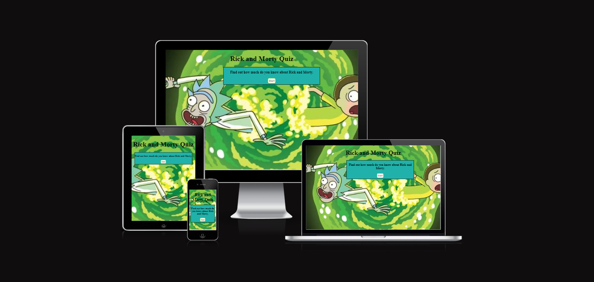
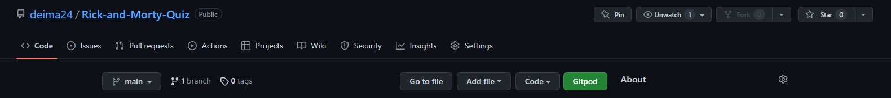
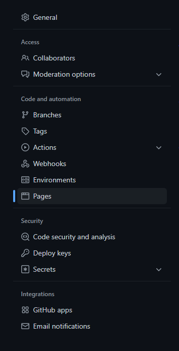
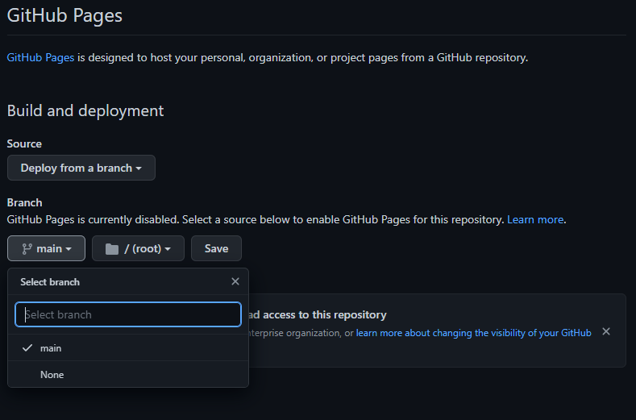
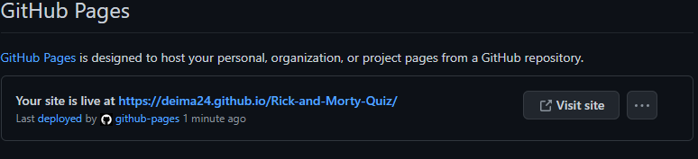
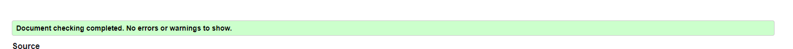
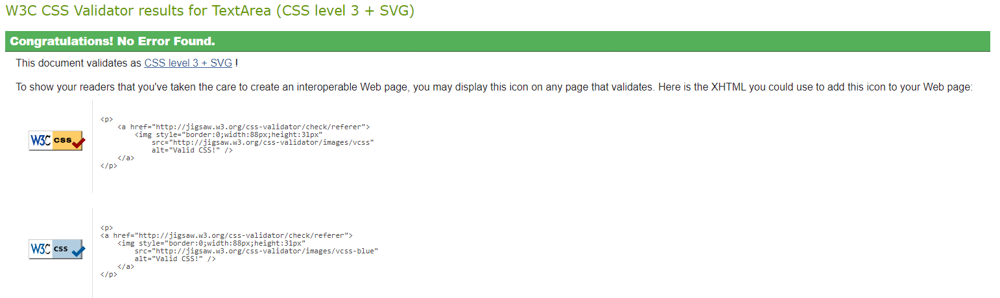
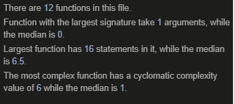

# Rick-and-Morty-Quiz

This Rick and Morty quiz is for people who want to test their knowledge about it. Questions are based on the show from the all seasons.
The show is very popular, so I just wanted to create this quiz about the show that I enjoy.

# Features

## Home Page

In the website when you open it you can see the main title at the top of the page. There is one button, when it is pressed the quiz will start and user can take the quiz of 10 questions about Rick and Morty show. When the Start button is pressed the Start button will disapeare and the question will apear. Pushed game area a bit more to the right so it would be between the Rick and Morty image.

## Quiz Page

When the user presses the Start button the quiz will start. The game area will change to the quiz and the game can begin.

At the top in a quiz area user can see at which question they are on out of total 10 questions. Each time user plays the game new random questions will apear from the array.

There is in total 30 questions and only 10 random questions will apear per game to the user.

Lover to the number of question you can see the question that the user has to answer it. Each question has four different answers choises and only one of it is correct.

Once the user has clicked on the correct answer it will turn to the green or it will become red so that means that the answer that user selected is wrong and the right answer will turn to the green. If the user clicks on the correct answer they will get 1 point. For each correct answer they will get one point. Once user clicks on an answer to the question ether it is correct or wrong the 'Next' button will apear to move to the next question.

## Quiz End

On the last question when the user answered instead of 'Next' button they will see the 'End' button meaning that they answered all 10 questions. If they answered more than 7 questions correct they will see a message congratulating them and how many point they got.

If the user scored less than 7 points they will see a message 'Better luck next time' and the score.

At the end player has two options what to do at the end. User can sellect 'Play Again' to start the game from the begining with new set of question. Or thay can sellect 'Home' which they will be taken back to the Home Page.

## Technologies used

I used this technologies to create this website.

1) HTML - Content and Structure

2) CSS - Styling

3) JavaScript - Functions

4) Gitpod - Website deployment

5) Github - Website Hosting

# Deployment

The site was deployd to the GitHub page by following these steps:

1) In GitHub repository locate setings.

2) Once in settings navigate the 'Pages' tab on the side menu.

3) Under the Branch sellect master or main , then click save.

4) After few minutes you can see your page is live and the link to your page is located under the GitHub Pages.

This section should describe the process you went through to deploy the project to a hosting platform (e.g. GitHub)

The site was deployed to GitHub pages. The steps to deploy are as follows:
In the GitHub repository, navigate to the Settings tab
From the source section drop-down menu, select the Master Branch
Once the master branch has been selected, the page will be automatically refreshed with a detailed ribbon display to indicate the successful deployment.
The live link can be found here - https://deima24.github.io/Rick-and-Morty-Quiz/

# Testing

HTML
No errors were returned when passing through the official W3C validator

CSS
No errors were found when passing through the official (Jigsaw) validator

JavaScript
No errors were found when passing through the official Jshint validator

## Future Features

Add more questions to the questions array as new seasons are realised are released.

Add music to the back ground while doing the quiz.

Change the background image so it would look nice to all difrent size divices.